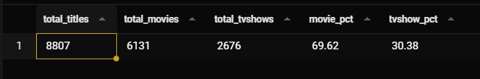
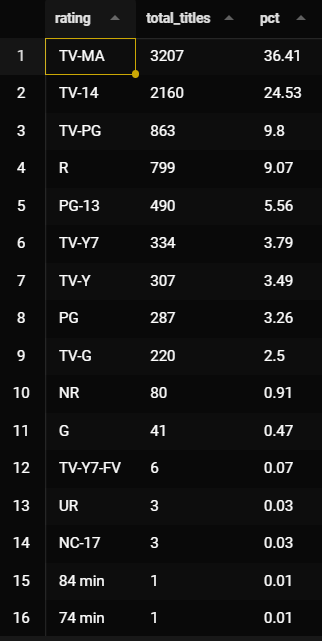
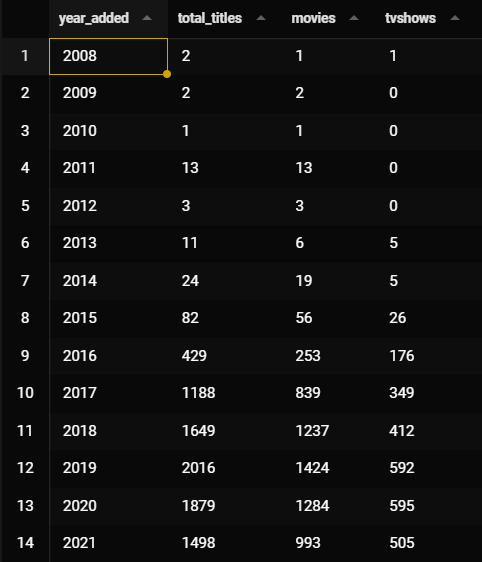
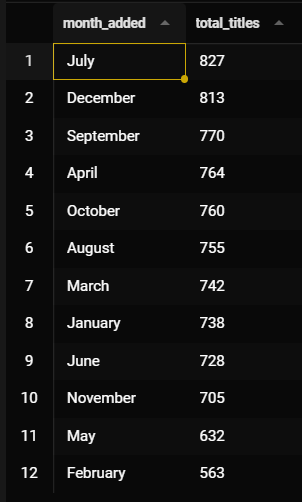
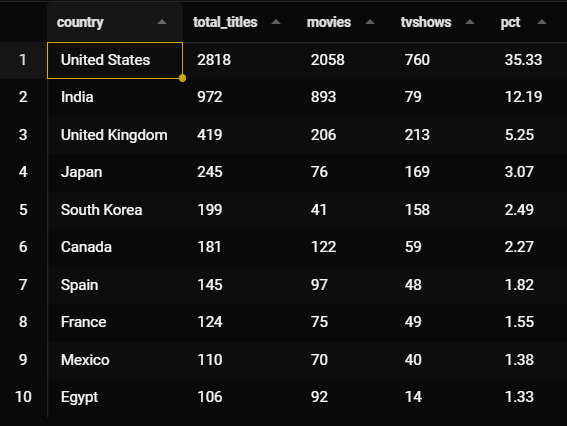
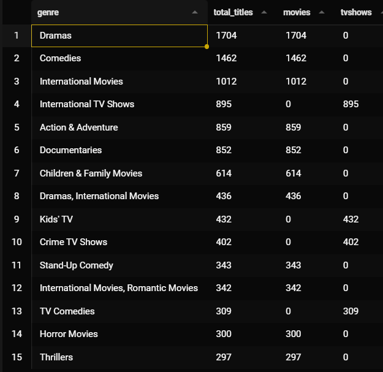
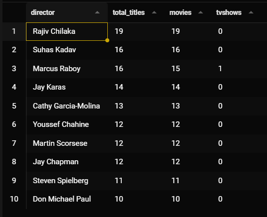
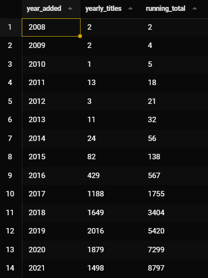
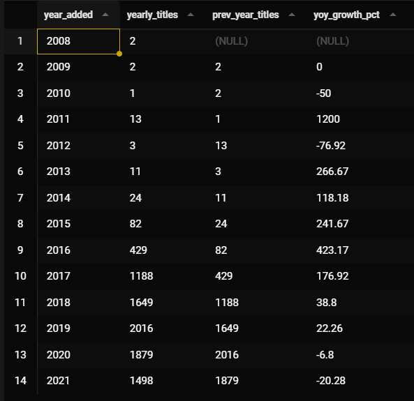

# 🎬 Netflix Content SQL Analysis

## Project Overview

This project analyzes **Netflix's content library** using SQL to extract business insights from a dataset covering movies, TV shows, genres, countries, ratings, and release trends.

> Dataset: 8,800+ titles · 100+ countries · 2008 – 2021

---


## Business Questions

| # | Business Question |
|---|---|
| 1 | What is the overall content breakdown? |
| 2 | How has Netflix grown its content over the years? |
| 3 | Which countries produce the most content? |
| 4 | What genres dominate the platform? |
| 5 | Who are the most featured directors and actors? |
| 6 | What are the YoY growth trends? |

---

## Section 1 — Overview KPIs

> **Business Question:** What is the overall health and breakdown of Netflix content?

### 1.1 Total Titles, Movies vs TV Shows

```sql
SELECT
    COUNT(*)                                              AS total_titles,
    COUNT(CASE WHEN type = 'Movie'   THEN 1 END)         AS total_movies,
    COUNT(CASE WHEN type = 'TV Show' THEN 1 END)         AS total_tvshows,
    ROUND(COUNT(CASE WHEN type = 'Movie' THEN 1 END) * 100.0
          / COUNT(*), 2)                                 AS movie_pct,
    ROUND(COUNT(CASE WHEN type = 'TV Show' THEN 1 END) * 100.0
          / COUNT(*), 2)                                 AS tvshow_pct
FROM netflix_titles;
```


**Result:**




Netflix focuses on movies, accounting for nearly 70% of all content, but TV shows also make up 30% because they retain engagement for longer periods, as viewers tend to return for multiple episodes.

---


### 1.2 Rating Distribution

```sql
SELECT
    rating,
    COUNT(*)                                              AS total_titles,
    ROUND(COUNT(*) * 100.0 / (SELECT COUNT(*) 
          FROM netflix_titles), 2)                       AS pct
FROM netflix_titles
WHERE rating IS NOT NULL
GROUP BY rating
ORDER BY total_titles DESC;
```

**Result:**





TV-MA accounts for 36% of all content, indicating that Netflix primarily focuses on adult content. The combined TV-MA and TV-14 content reaches 60% of the total, reflecting Netflix's main target audience of teenagers and adults.


---

## Section 2 — Content Trend Analysis

> **Business Question:** How has Netflix grown its content library over the years?

### 2.1 Titles Added per Year

```sql
SELECT
    SUBSTR(date_added, -4)                               AS year_added,
    COUNT(*)                                             AS total_titles,
    COUNT(CASE WHEN type = 'Movie'   THEN 1 END)         AS movies,
    COUNT(CASE WHEN type = 'TV Show' THEN 1 END)         AS tvshows
FROM netflix_titles
WHERE date_added IS NOT NULL
GROUP BY year_added
ORDER BY year_added;
```

**result**





- Netflix started adding content aggressively from 2016 onwards.
- 2019 was the year with the most added content, over 1,771 titles.
- Movies account for a larger proportion than series every year, but series are showing a continuous upward trend.


---

### 2.2 Month with Most Content Added

```sql
SELECT
    SUBSTR(date_added, 1, INSTR(date_added, ' ') - 1)   AS month_added,
    COUNT(*)                                             AS total_titles
FROM netflix_titles
WHERE date_added IS NOT NULL
GROUP BY month_added
ORDER BY total_titles DESC;
```


**result**




- January is the busiest month, with Netflix adding a lot of content at the beginning of the year.
- The end of the year, November–December, also sees high viewership, coinciding with the holiday season when more people watch movies.


---

## Section 3 — Country Analysis

> **Business Question:** Which countries produce the most content on Netflix?

### 3.1 Top 10 Countries by Content

```sql
SELECT
    TRIM(country)                                        AS country,
    COUNT(*)                                             AS total_titles,
    COUNT(CASE WHEN type = 'Movie'   THEN 1 END)         AS movies,
    COUNT(CASE WHEN type = 'TV Show' THEN 1 END)         AS tvshows,
    ROUND(COUNT(*) * 100.0 / (SELECT COUNT(*) 
          FROM netflix_titles 
          WHERE country IS NOT NULL), 2)                 AS pct
FROM netflix_titles
WHERE country IS NOT NULL
  AND INSTR(country, ',') = 0
GROUP BY TRIM(country)
ORDER BY total_titles DESC
LIMIT 10;
```

**result**





- The United States accounts for 45% of all content.
- India is second, but mostly films, with very few series, reflecting the strong Bollywood industry.


---

## Section 4 — Genre Analysis

> **Business Question:** What genres dominate the Netflix platform?

### 4.1 Top Genres

```sql
WITH genre_split AS (
    SELECT
        show_id,
        type,
        TRIM(SUBSTR(listed_in, 1,
            CASE WHEN INSTR(listed_in, ',') > 0
                 THEN INSTR(listed_in, ',') - 1
                 ELSE LENGTH(listed_in) END))            AS genre
    FROM netflix_titles
    UNION ALL
    SELECT
        show_id,
        type,
        TRIM(SUBSTR(listed_in,
            INSTR(listed_in, ',') + 1))                  AS genre
    FROM netflix_titles
    WHERE INSTR(listed_in, ',') > 0
)
SELECT
    genre,
    COUNT(*)                                             AS total_titles,
    COUNT(CASE WHEN type = 'Movie'   THEN 1 END)         AS movies,
    COUNT(CASE WHEN type = 'TV Show' THEN 1 END)         AS tvshows
FROM genre_split
WHERE genre != ''
GROUP BY genre
ORDER BY total_titles DESC
LIMIT 15;
```

**result**




The number one drama ranking indicates that Netflix invests heavily in drama content.


---

## Section 5 — Directors & Cast

> **Business Question:** Who are the most featured directors and actors on Netflix?

### 5.1 Top 10 Directors

```sql
SELECT
    TRIM(director)                                       AS director,
    COUNT(*)                                             AS total_titles,
    COUNT(CASE WHEN type = 'Movie'   THEN 1 END)         AS movies,
    COUNT(CASE WHEN type = 'TV Show' THEN 1 END)         AS tvshows
FROM netflix_titles
WHERE director IS NOT NULL
  AND INSTR(director, ',') = 0
GROUP BY TRIM(director)
ORDER BY total_titles DESC
LIMIT 10;
```

**result**




Everyone on the list except Marcus Raboy is 100% film-based, indicating that the series rarely has a single director for the entire season; each episode uses a different director.


---

## Section 6 — Advanced Analytics

> **Business Question:** What are the running totals and year-over-year growth trends?

### 6.1 Running Total of Titles Added per Year

```sql
SELECT
    year_added,
    yearly_titles,
    SUM(yearly_titles) OVER (
        ORDER BY year_added
        ROWS BETWEEN UNBOUNDED PRECEDING AND CURRENT ROW
    )                                                    AS running_total
FROM (
    SELECT
        SUBSTR(date_added, -4)                           AS year_added,
        COUNT(*)                                         AS yearly_titles
    FROM netflix_titles
    WHERE date_added IS NOT NULL
    GROUP BY year_added
)
ORDER BY year_added;
```

**result**





- From 2008–2016, there were 567 pieces of content.
- But that number increased by another 8,230 pieces in just 4 years (2017–2021).
- The `running_total` metric helps to illustrate the exponential growth more clearly than looking at it only on an annual basis.


---

### 6.2 Year-over-Year Growth Rate

```sql
SELECT
    year_added,
    yearly_titles,
    prev_year_titles,
    CASE
        WHEN prev_year_titles IS NULL THEN NULL
        ELSE ROUND((yearly_titles - prev_year_titles) * 100.0
                   / prev_year_titles, 2)
    END                                                  AS yoy_growth_pct
FROM (
    SELECT
        SUBSTR(date_added, -4)                           AS year_added,
        COUNT(*)                                         AS yearly_titles,
        LAG(COUNT(*)) OVER (
            ORDER BY SUBSTR(date_added, -4)
        )                                                AS prev_year_titles
    FROM netflix_titles
    WHERE date_added IS NOT NULL
    GROUP BY year_added
)
ORDER BY year_added;
```

**result**





- In 2011, growth was +1,200%, unusually high, but because the base was very small (1 → 13 titles), the number seemed inflated.
- 2013–2017 saw very high growth, a period when Netflix expanded rapidly worldwide.
- 2020–2021 experienced negative growth due to COVID-19 causing production disruptions.


---


